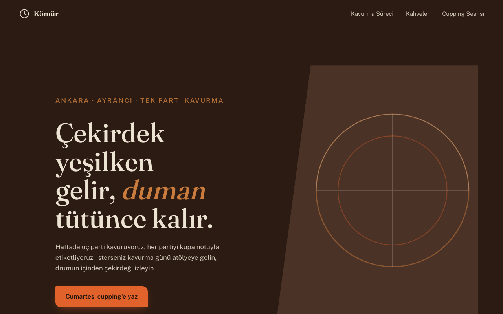
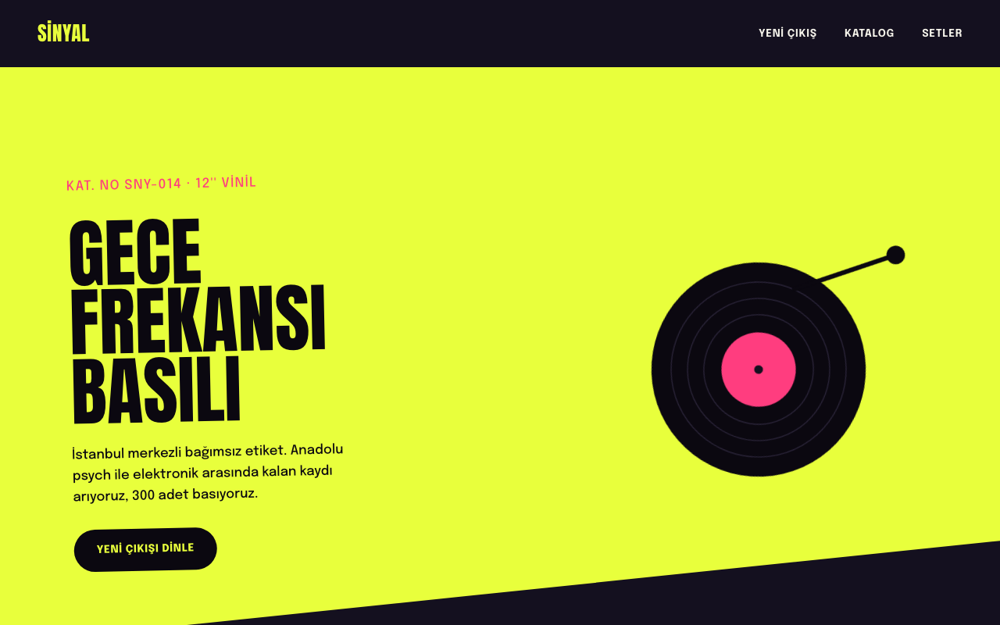
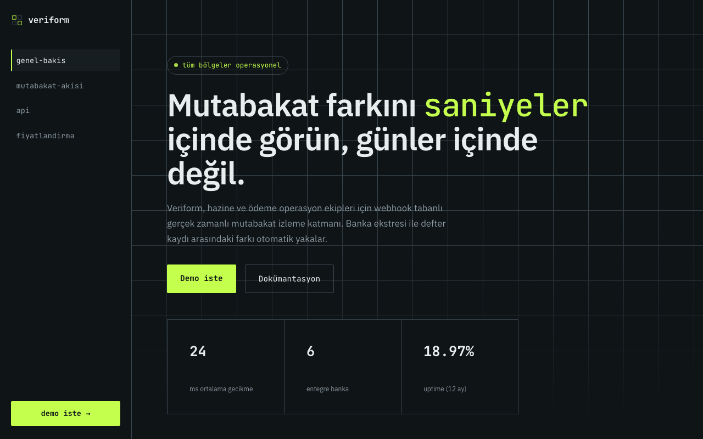
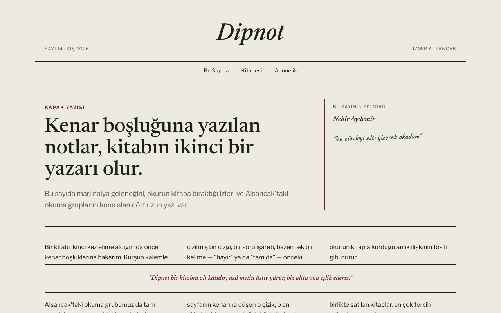
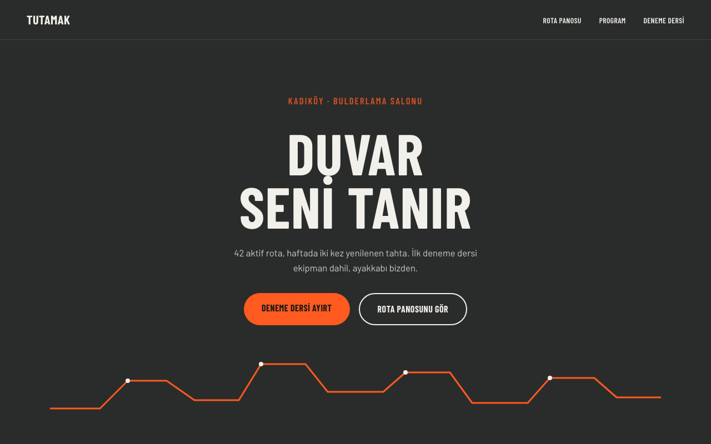
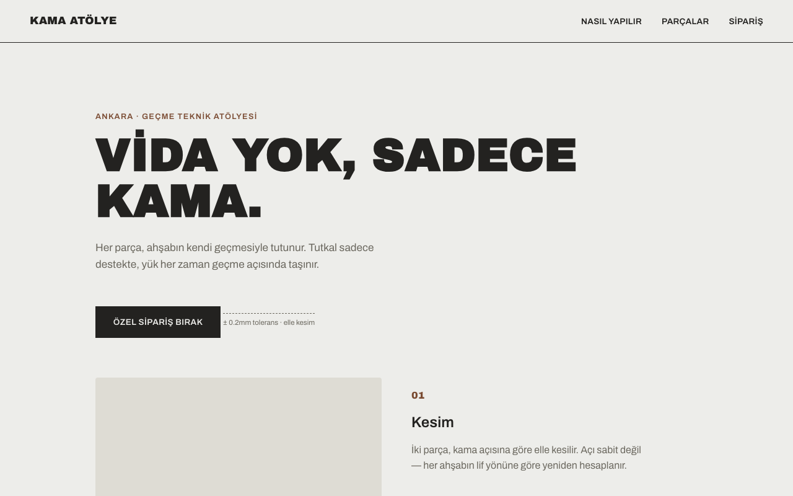

# FrontendDev — Anti-Generic Frontend Design Skill for Claude Code

A [Claude Code](https://claude.com/claude-code) skill that builds frontends that **don't look AI-generated**: every site gets a one-off Design DNA, gets checked against a catalog of known "AI look" patterns, ships with full on-page SEO, and must pass a screenshot self-critique loop before it's called done.

> 🇹🇷 Türkçe kullanım kılavuzu için: [BENİ-OKU.md](BENİ-OKU.md)

## Why

Left unguided, AI-generated frontends converge on the same handful of looks: the cream-and-terracotta serif page, the near-black page with one acid accent, the purple gradient hero, the emoji feature-card grid, Inter everywhere, fade-in-up on everything. Each choice is individually reasonable — all of them together, undeviated, is what makes a page instantly recognizable as generated.

This skill makes deviation systematic instead of accidental.

## What it does

| Capability | How |
|---|---|
| **Unique per project** | A Design DNA (named hex palette, type pair, layout skeleton as ASCII wireframe, hero composition, one signature element, motion level) is generated before any code — seeded from the brand's letterforms, the sector's real-world materials, and an explicit anti-first-instinct rule. The same brief twice produces two different designs. |
| **Never the "AI look"** | 36-entry [banned-pattern catalog](data/banned-patterns.md) (hard bans + conditional-with-justification) covering palettes, typography, layout skeletons, hero compositions, components, copywriting clichés (English *and* Turkish), and motion. Any hit regenerates that axis. |
| **Never repeats itself** | An append-only [design log](design-log.md) records every shipped build's skeleton, hero composition, and palette family. A new DNA overlapping any logged build on 2+ of those axes is rerolled — cross-session sibling designs (the failure mode that motivated v1.1) can't silently recur. |
| **Reference-site analysis** | Give it URLs ("make it feel like X") — it runs a visual pass (screenshots) *and* a code pass (HTML/CSS token extraction), writes a Reference Design Brief, and extracts principles, never pixels. A mandatory "deliberate divergence" line prevents clones. |
| **Component sourcing** | Pulls real components live from 21st.dev, shadcn/ui, Aceternity, Magic UI and 12 more — then force-remaps every color/font/spacing/radius/shadow token onto the project DNA. Source code never ships as-is. |
| **Full SEO integration** | Keyword research (Semrush MCP if connected, WebSearch fallback) runs *before* page architecture. Semantic HTML, meta/OG, schema.org JSON-LD, sitemap, robots.txt, and Core Web Vitals budgets (LCP < 2.5s, CLS < 0.1, INP < 200ms) are build inputs, not afterthoughts. |
| **Screenshot self-critique** | After building: a concrete verification recipe first (375px overflow check with known-culprit list, computed-value contrast), then screenshot (desktop + mobile), score against a 10-point "is this AI work?" test plus a distinctive-vs-sophisticated two-bar check. Fails → revise the failing axis and re-shoot. |
| **Multi-page & Turkish copy** | Sibling-pages rules for multi-page sites (one token source, per-page skeleton variation, breadcrumb/schema wiring) and a Turkish microcopy bank (sector-specific CTA verbs, form labels, error tone). |
| **Adaptive stack** | Decision tree picks per project: plain HTML/CSS/JS, Astro, Next.js + Tailwind, or Nuxt. CSR-only SPAs are disqualified for anything that needs to rank. |

## Install

```bash
git clone https://github.com/0x61A/frontend-dev-skill.git
mkdir -p ~/.claude/skills/frontend-dev
cp -r frontend-dev-skill/SKILL.md frontend-dev-skill/BENİ-OKU.md \
      frontend-dev-skill/references frontend-dev-skill/data \
      ~/.claude/skills/frontend-dev/

# optional: /FrontendDev slash command
mkdir -p ~/.claude/commands
cp frontend-dev-skill/commands/FrontendDev.md ~/.claude/commands/
```

New Claude Code sessions pick the skill up automatically.

## Usage

Trigger it naturally:

- *"Build a unique landing page for a coffee roastery — SEO matters"*
- *"Make it feel like these two sites: `<url>` `<url>`"*
- *"Grab a pricing section from 21st.dev and adapt it to the project"*
- Or explicitly: `/frontend-dev <brief>` · `/FrontendDev <brief or reference URLs>`

The skill then walks six phases: **brief intake → reference analysis → Design DNA → SEO foundation → build → self-critique loop**. It will ask 2–4 batched questions when the brief is underspecified, and states its assumptions when running autonomously.

## Examples

Six demos built end-to-end by the skill — same workflow, deliberately divergent Design DNA and layout skeleton every time. See [`examples/`](examples/) for source and the full breakdown of what makes each one different.

<table>
<tr>
<td width="33%"><a href="examples/komur-roastery/index.html"></a><br><sub><b>Kömür Roastery</b> — diagonal flow, warm umber, Fraunces</sub></td>
<td width="33%"><a href="examples/sinyal-records/index.html"></a><br><sub><b>Sinyal Records</b> — broken grid, split-duotone, Anton</sub></td>
<td width="33%"><a href="examples/veriform/index.html"></a><br><sub><b>Veriform</b> — sidebar-anchored, dark mono, live ticker</sub></td>
</tr>
<tr>
<td width="33%"><a href="examples/dipnot/index.html"></a><br><sub><b>Dipnot</b> — editorial columns, paper tone, Newsreader, zero motion</sub></td>
<td width="33%"><a href="examples/tutamak/index.html"></a><br><sub><b>Tutamak</b> — color-block zoning, concrete + orange, Barlow</sub></td>
<td width="33%"><a href="examples/kama-atolye/index.html"></a><br><sub><b>Kama Atölye</b> — sticky-scroll narrative, walnut accent, Archivo Black</sub></td>
</tr>
</table>

## Repository layout

```
SKILL.md                          entry point — hard rules, 6-phase workflow, routing
BENİ-OKU.md                       Turkish user guide
design-log.md                     append-only build registry (cross-session uniqueness check)
references/
  anti-generic.md                 verification recipe + 10-point AI-tell test + critique loop + a11y quality floor
  design-dna.md                   DNA generation process (incl. dark mode) + DNA card format
  reference-analysis.md           visual + code analysis of reference sites
  component-sourcing.md           fetch-and-transform rules + imagery sourcing (licenses, treatment recipes)
  multi-page.md                   one DNA, sibling pages — multi-page site rules
  seo-full.md                     keyword research → architecture → on-page → schema → CWV
  stack-selection.md              per-project stack decision tree
data/
  banned-patterns.md              the 36-entry AI-look blocklist + pass criteria
  style-axes.csv                  72 style-matrix axes (value scheme, geometry, texture, layout skeleton, hero composition, signature types…)
  font-pairings.csv               58 characterful pairings (no default-Inter displays; Turkish-diacritic-safe options included)
  component-sources.csv           20 live component sources with transform notes
  microcopy-tr.md                 Turkish microcopy bank (CTA verbs, form labels, error tone)
commands/
  FrontendDev.md                  optional /FrontendDev slash command
```

## Requirements

- [Claude Code](https://claude.com/claude-code) (CLI, desktop, or web)
- Optional, used when available: a Semrush MCP connection (real keyword data), a browser tool for screenshots (Claude in Chrome, Claude Preview, or Playwright) — the skill degrades gracefully and says so when a tool is missing

## Design notes

- Accessibility always beats distinctiveness on conflict: WCAG AA contrast, visible focus, `prefers-reduced-motion`, 375px responsiveness are a silent quality floor.
- Reference sites and component marketplaces are treated differently on purpose: references are *principle* sources (code never copied), marketplaces are *code* sources (code always transformed).
- The banned-pattern catalog is meant to grow. PRs that add newly-emerged "AI look" patterns are welcome.

## Acknowledgements

Some anti-generic design concepts were adapted from Anthropic's `frontend-design` skill (Apache 2.0). All prose in this repository is original.

## License

[MIT](LICENSE) © 2026 Ahmet Şerif Kart
