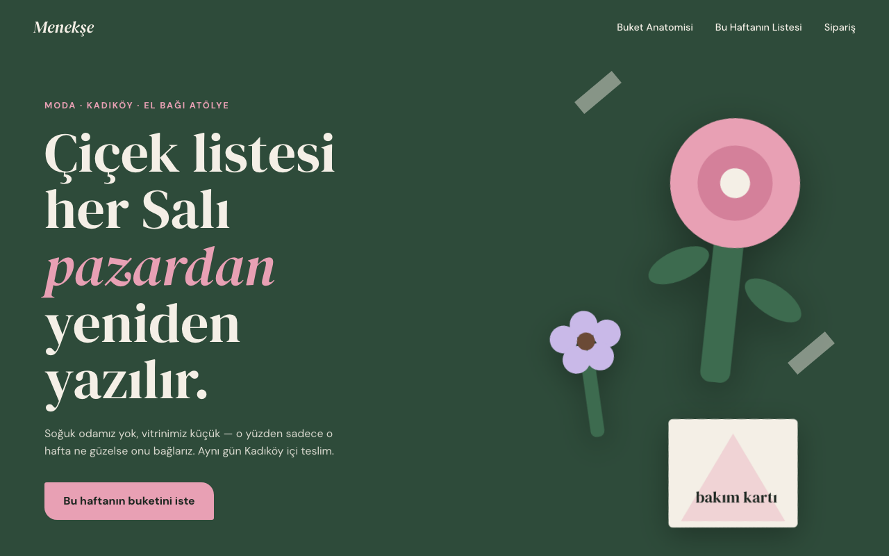
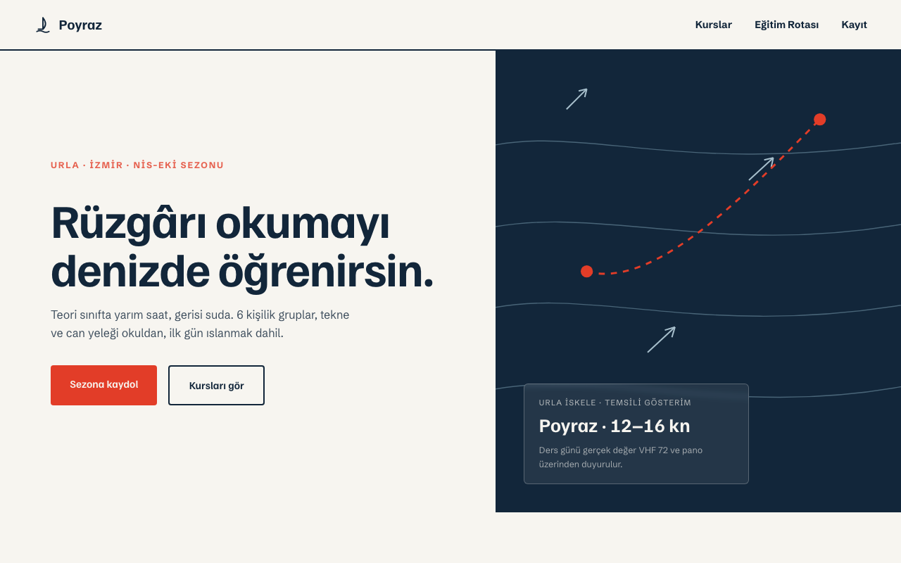
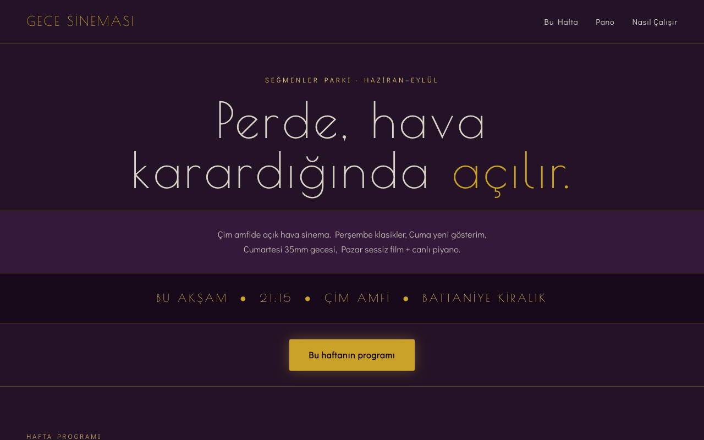

# Örnek Tasarımlar

FrontendDev skill'inin 6 fazlı iş akışıyla üretilmiş, birbirinden bağımsız üç demo. Her biri farklı bir Design DNA taşır — palet, tip çifti, layout iskeleti, motion seviyesi ve imza öğesi hiçbirinde tekrar etmez.

### [Kömür Roastery](komur-roastery/index.html) — kahve kavurma atölyesi

Diagonal flow iskelet · sıcak mid-tone umber palet · Fraunces / Public Sans · kavurma süreci boyunca dolan drum çubuğu imza öğesi.

### [Sinyal Records](sinyal-records/index.html) — bağımsız plak etiketi

Broken grid iskelet · split-duotone sarı/mor-siyah + pembe · Anton / Epilogue · dönen vinil + tonearm, imleç takip eden nokta.

### [Veriform](veriform/index.html) — fintech mutabakat altyapısı

Sidebar-anchored iskelet · katmanlı koyu slate + tek lime accent · JetBrains Mono / IBM Plex Sans · gerçek zamanlı (simüle) mutabakat akışı.

### [Dipnot](dipnot/index.html) — bağımsız kitabevi ve edebiyat dergisi

Editorial columns iskelet (gerçek çok sütunlu gazete/dergi düzeni) · kağıt tonu + şarap/şişe yeşili · Newsreader / Libre Franklin · sıfır animasyon (static motion) · kenar-notu (marjinalya) imza öğesi.

### [Tutamak](tutamak/index.html) — Kadıköy bulderlama salonu

Color-block zoning iskelet (tam genişlik renk bloklarıyla bölünen bölümler) · beton grisi + tek turuncu tutamak rengi · Barlow Condensed / Barlow · açısal topo-rota çizgisi imza öğesi (daire/disk grafiği yok).

### [Kama Atölye](kama-atolye/index.html) — geçmeli masif ahşap mobilya

Sticky-scroll narrative iskelet (sabitlenen geçme diyagramı, kaydırdıkça açılıyor) · nötr galeri grisi + tek ceviz vurgusu · Archivo Black / Archivo · üç aşamalı geçme animasyonu imza öğesi.

### [Menekşe Çiçekçilik](menekse-cicekcilik/index.html) — el bağı buket atölyesi *(v1.1 ile üretildi)*

Overlap-stack iskelet (kartlar bölümler arası taşar) · offset-kolaj hero (AX62) · mid-tone botanik yeşili + petal pembe · DM Serif Display / DM Sans · numaralı buket-anatomisi annotasyonları imza öğesi (AX49).

### [Poyraz Yelken](poyraz-yelken/index.html) — yelken okulu *(v1.1 ile üretildi)*

Asimetrik split iskelet (35/65) · dikey split-screen hero (AX59) · açık marin (yelken beyazı/lacivert + şamandıra kırmızısı) · Familjen Grotesk / Schibsted Grotesk · deniz haritası çizgileri + rota imza öğesi (AX45).

### [Gece Sineması](gece-sinemasi/index.html) — açık hava yazlık sinema *(v1.1 ile üretildi)*

Yatay bant-istifi hero (AX63) + tek bilinçli yatay program şeridi (AX29, klavyeyle gezilebilir) · derin eflatun gece + pirinç marquee · Poiret One / Didact Gothic · elle dizilen harf panosu imza öğesi (AX50).

---

Her klasör bağımsız, framework'süz tek `index.html` — doğrudan tarayıcıda açılabilir.

**Neden dokuz tasarım da birbirinden farklı:** her biri farklı bir layout iskeleti kullanıyor (diagonal flow, broken grid, sidebar-anchored, editorial columns, color-block zoning, sticky-scroll narrative, overlap stack, asimetrik split, bant istifi + yatay şerit) — hiçbiri "aynı iskelet, farklı renk" değil. İlk üçte (Kömür, Sinyal) tekrar eden diagonal-kesim + daire/disk hero deseni v1.1'de BP32 olarak yasaklandı; son üç tasarım v1.1'in `hero_composition` ekseni ve kalıcı design-log kontrolüyle üretildi — hiçbiri önceki build'lerle 2+ eksende çakışmıyor, üçü de 375px taşma reçetesinden geçti.
